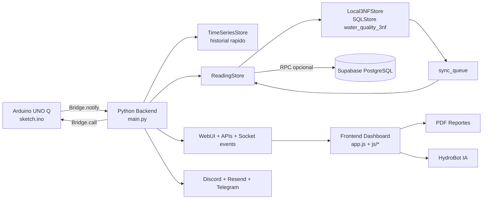
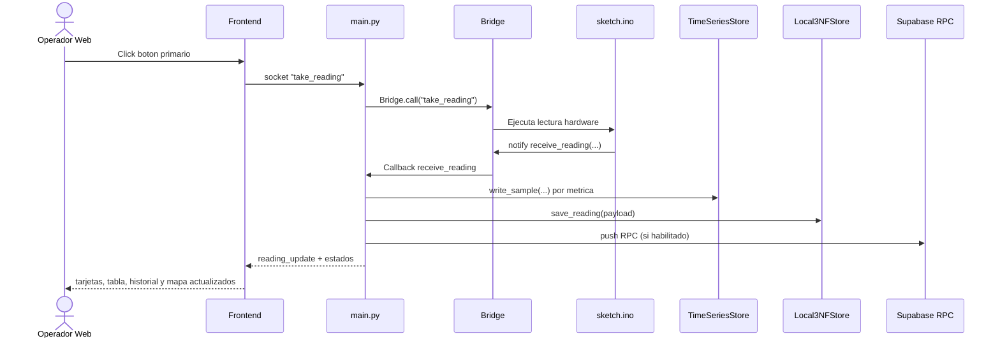
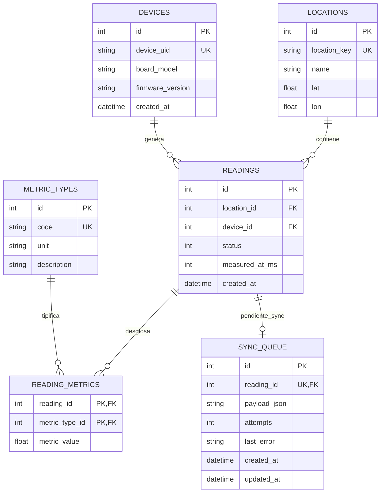

<p align="center">
  
</p>
 
 # HydroLabs - Dashboard de Monitoreo de Calidad de Agua


Sistema de monitoreo de calidad de agua en tiempo real para Panama, con enfoque operativo en:

- pH
- Turbidez (NTU)
- TDS (ppm)

Incluye dashboard interactivo, mapa georreferenciado, historicos, exportaciones JSON, generacion de reportes PDF, chatbot con IA, alertas por Discord/Resend y persistencia robusta en base de datos local normalizada (3FN) con sincronizacion opcional a Supabase.

<p align="center">
  <a href="https://youtu.be/OrZo3yLHClY">
    
  </a>
</p>

<p align="center">
  ▶️ Click para ver demo del sistema HydroLabs
</p>

## Tabla de contenidos

1. [Resumen rapido](#resumen-rapido)
2. [Arquitectura general](#arquitectura-general)
3. [Frontend en detalle](#frontend-en-detalle)
4. [Backend en detalle](#backend-en-detalle)
5. [Base de datos en detalle](#base-de-datos-en-detalle)
6. [API HTTP y eventos en tiempo real](#api-http-y-eventos-en-tiempo-real)
7. [Variables de entorno (.env)](#variables-de-entorno-env)
8. [Estructura del proyecto](#estructura-del-proyecto)
9. [Como ejecutar](#como-ejecutar)
10. [Pruebas y validacion](#pruebas-y-validacion)
11. [Solucion de problemas](#solucion-de-problemas)

---

## Resumen rapido

- La UI principal se renderiza desde `assets/js/ui-shell.js` sobre `#app-root`.
- `assets/index.html` redirige por defecto a `landing.html`; para abrir dashboard se usa `index.html?dashboard=1`.
- El control principal de captura/lectura es un boton toggle unificado:
  - Estado activo: `Pausar Captura`
  - Estado pausado: `Tomar Lectura`
- El backend central (`python/main.py`) expone APIs, sockets, reglas operativas y flujo de persistencia.
- Persistencia en 2 niveles:
  - Series de tiempo (`TimeSeriesStore`) para graficas y historicos.
  - Modelo 3FN local (`SQLStore`) para lecturas estructuradas.
- Sincronizacion remota opcional a Supabase por RPC con cola de reintentos local.

Estados de calidad de agua:

- `0` -> Apta (verde)
- `1` -> Tolerable (amarillo)
- `2` -> No apta (rojo)

---

## Arquitectura general



---

## Frontend en detalle

### 1) Paginas y navegacion

| Pagina | Archivo | Rol |
| --- | --- | --- |
| Landing | `assets/landing.html` | Entrada comercial/explicativa |
| Componentes | `assets/components.html` | Documentacion de hardware y sensores |
| Dashboard | `assets/index.html?dashboard=1` | Operacion en tiempo real |

Patron de navegacion:

- `assets/index.html` contiene un guard de query (`?dashboard=1`) para evitar entrar al panel por accidente.
- Header comun en el shell con enlaces a `landing`, `components` y `dashboard`.

### 2) Modulos frontend por responsabilidad

| Modulo | Archivo | Responsabilidad principal |
| --- | --- | --- |
| Shell UI | `assets/js/ui-shell.js` | Estructura visual completa del dashboard (tabs, cards, controles, chatbot) |
| Orquestacion | `assets/app.js` | Estado global, eventos de UI, mapa, tablas, historicos, sockets, sincronizacion de vistas |
| Dominio cliente | `assets/js/domain.js` | Ubicaciones, estado mock, reglas de estado y helpers |
| API cliente | `assets/js/api.js` | `apiFetch` + normalizacion de `runtime_config` |
| Graficas | `assets/js/charts.js` | Construccion y render de charts con Chart.js |
| Reportes | `assets/js/reports.js` | PDF en navegador + envio por correo via backend |
| Chatbot | `assets/js/chatbot.js` | UI conversacional, estado de API key local/backend, llamadas a `/chat` |
| Estilos | `assets/style.css` | Tema, componentes visuales, estados interactivos, accesibilidad |

### 3) Interaccion y UX operativa

- Boton primario toggle:
  - Captura activa -> pausa captura.
  - Captura pausada -> ejecuta lectura y guardado.
- Mensajeria de estado visible:
  - Preview no guardada
  - Guardando
  - Guardado en DB
  - Error
  - Modo prueba
- Feedback de configuracion:
  - Chatbot indica si usa clave local o clave backend (`.env`).
  - Alertas muestran si Discord/Resend estan listos.
  - Dialogo de reporte deshabilita envio email si Resend no esta configurado.

### 4) Librerias frontend

- Tailwind CSS (via CDN)
- Chart.js
- Leaflet
- jsPDF
- html2canvas
- Socket.IO client
- Lucide icons

---

## Backend en detalle

### 1) Componentes y capas

| Capa | Archivo(s) | Funcion |
| --- | --- | --- |
| Runtime principal | `python/main.py` | Orquesta sensores, lectura, estado, APIs, sockets e integraciones |
| Reglas de dominio | `python/domain.py` | Umbrales y calculo del estado de calidad |
| Acceso de consulta | `python/repository.py` | Consultas de latest y samples para UI |
| Persistencia 3FN + sync | `python/reading_store.py` | Guardado estructurado local + cola + push RPC a Supabase |
| Alertas | `python/alerts.py` | Envio por Discord webhook y correo Resend |
| Configuracion | `python/config.py` | Carga/parse de `.env` y defaults seguros |

### 2) Flujo de lectura real



### 3) Integraciones backend

- OpenRouter (`/chat`) para HydroBot.
- Resend (`/send_report` y alertas email).
- Discord webhook (`/test_notifications` y alertas criticas).
- Telegram bot (`/test_notifications` con chat_id opcional, o con chats registrados/whitelist).
- Telegram bot (comandos operativos: estado, lectura, captura, ubicacion).

### 4) Modo prueba y seguridad operativa

- `TEST_MODE=true`: UI con mocks, sin persistencia real.
- Validaciones de placeholders para evitar considerar credenciales falsas como configuradas.
- Control de frecuencia minima entre lecturas (`MIN_TAKE_READING_GAP_S`).
- Temporizador de calibracion por ubicacion (`SENSOR_CALIBRATION_S`).

---

## Base de datos en detalle

La persistencia se diseña en capas para resiliencia y trazabilidad.

### Capa A - TimeSeriesStore (historicos rapidos)

- Guarda series por recurso (`ph_*`, `ntu_*`, `tds_*`, `estado_*`, etc.).
- Se usa para graficas y paneles de historial.

### Capa B - Local3NFStore (modelo relacional normalizado)

Base local: `water_quality_3nf`

Tablas principales:

- `locations`
- `devices`
- `metric_types`
- `readings`
- `reading_metrics`
- `sync_queue`

Ventajas:

- Lectura estructurada por entidad y metrica.
- Indices para consultas por ubicacion/tiempo.
- Cola local para sincronizacion diferida.

### Capa C - Supabase (opcional)

- Si `SUPABASE_SYNC_ENABLED=true` y credenciales validas:
  - `ReadingStore` invoca RPC `ingest_water_reading`.
- Si falla red/credencial:
  - La lectura queda en `sync_queue` local.
  - Se reintenta automaticamente desde el loop.

### ERD 3FN



---

## API HTTP y eventos en tiempo real

### Endpoints HTTP

| Metodo | Ruta | Descripcion |
| --- | --- | --- |
| GET | `/get_samples/{resource}/{start}/{aggr_window}` | Historico agregado por recurso |
| GET | `/get_latest_all` | Ultimo snapshot por ubicacion |
| GET | `/get_recent_readings/{loc}/{limit}` | Ultimas lecturas persistidas (con fallback) |
| GET | `/export_readings_json/{loc}/{limit}` | Export JSON de lecturas |
| GET | `/runtime_config` | Estado operativo del runtime |
| POST | `/set_location/{loc}` | Cambia ubicacion activa |
| POST | `/take_reading` | Solicita lectura puntual |
| POST | `/set_capture_enabled/{state}` | Activa o pausa captura |
| POST | `/chat` | Consulta a HydroBot |
| POST | `/send_report` | Envia PDF por correo |
| POST | `/test_notifications` | Prueba Discord/Resend/Telegram |

### Eventos Socket

| Evento | Direccion | Uso |
| --- | --- | --- |
| `get_reading_state` | Frontend -> Backend | Sincronizar estado inicial |
| `take_reading` | Frontend -> Backend | Disparar lectura via bridge |
| `preview_update` | Backend -> Frontend | Vista previa no persistida |
| `reading_update` | Backend -> Frontend | Lectura confirmada/persistida |
| `reading_state_update` | Backend -> Frontend | Inicio/fin de lectura |
| `capture_state_update` | Backend -> Frontend | Estado de captura |
| `calibration_state_update` | Backend -> Frontend | Countdown de calibracion |
| `reading_error` | Backend -> Frontend | Error funcional |
| `cpu_usage` / `memory_usage` | Backend -> Frontend | Telemetria del host |

---

## Variables de entorno (.env)

Archivo: `python/.env`

### Core

| Variable | Uso |
| --- | --- |
| `TEST_MODE` | Habilita modo simulacion |
| `SENSOR_CALIBRATION_S` | Segundos de estabilizacion por ubicacion |
| `MIN_TAKE_READING_GAP_S` | Gap minimo entre lecturas |
| `READING_CAPTURE_ENABLED_DEFAULT` | Estado inicial de captura |
| `DEVICE_UID` | ID logico del dispositivo |

### Alertas y reportes

| Variable | Uso |
| --- | --- |
| `DISCORD_WEBHOOK_URL` | Canal Discord |
| `RESEND_API_KEY` | API key de Resend |
| `RESEND_FROM` | Correo remitente |
| `ALERT_RECIPIENTS` | Correos destino (CSV) |
| `ALERT_COOLDOWN_S` | Cooldown de alertas |

### Chatbot

| Variable | Uso |
| --- | --- |
| `OPENROUTER_API_KEY` | API key del chatbot HydroBot |
| `OPENROUTER_MODEL` | Modelo de OpenRouter (default: `openrouter/auto`) |

### Telegram

| Variable | Uso |
| --- | --- |
| `TELEGRAM_BOT_ENABLED` | Habilitar bot |
| `TELEGRAM_BOT_TOKEN` | Token BotFather |
| `TELEGRAM_ENABLE_BUILTIN_WELCOME` | Mensaje de bienvenida builtin |
| `TELEGRAM_WHITELIST_USER_IDS` | IDs autorizados (CSV) |
| `TELEGRAM_CA_BUNDLE` | Ruta opcional a CA bundle PEM para TLS de Telegram |

Para pruebas por API:

- `POST /test_notifications` usa Telegram automáticamente si hay `chat_id` conocido.
- Puedes pasar `telegram_chat_id` (o `chat_id`) en el body para forzar el destino en esa prueba.

### Supabase sync (opcional)

| Variable | Uso |
| --- | --- |
| `SUPABASE_SYNC_ENABLED` | Activar sync remoto |
| `SUPABASE_URL` | URL del proyecto |
| `SUPABASE_SERVICE_ROLE_KEY` | Credencial server-to-server |
| `SUPABASE_RPC_INGEST` | Nombre de funcion RPC |

---

## Estructura del proyecto

```text
dashboard/
  assets/
    index.html
    landing.html
    components.html
    app.js
    style.css
    js/
      api.js
      charts.js
      domain.js
      ui-shell.js
      reports.js
      chatbot.js
  python/
    main.py
    config.py
    domain.py
    repository.py
    reading_store.py
    alerts.py
    requirements.txt
    supabase.sql
  sketch/
    sketch.ino
  app.yaml
```

---

## Como ejecutar

### Opcion recomendada: Arduino App Lab

1. Abre el proyecto en Arduino App Lab.
2. Configura `python/.env` con tus credenciales reales.
3. Conecta Arduino UNO Q y sensores en pines definidos.
4. Ejecuta la app.
5. Abre:
   - `landing.html` para portada
   - `index.html?dashboard=1` para operacion

### Dependencias Python

Instalar desde:

- `python/requirements.txt`

Dependencias clave:

- `requests`
- `resend`
- `psutil`

---
## Notas de alcance

Esta version productiva esta centrada en sensores de calidad de agua:

- pH
- Turbidez (NTU)
- TDS (ppm)

La arquitectura ya contempla expansion futura, pero el alcance operativo actual se valida con ese set de sensores.
